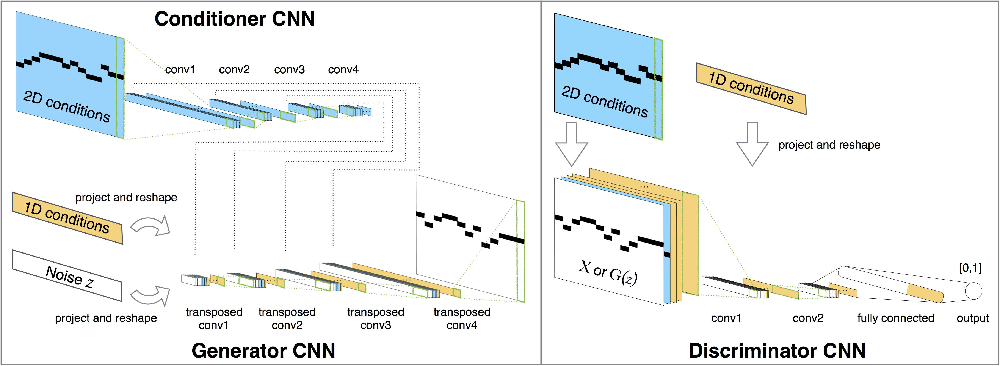
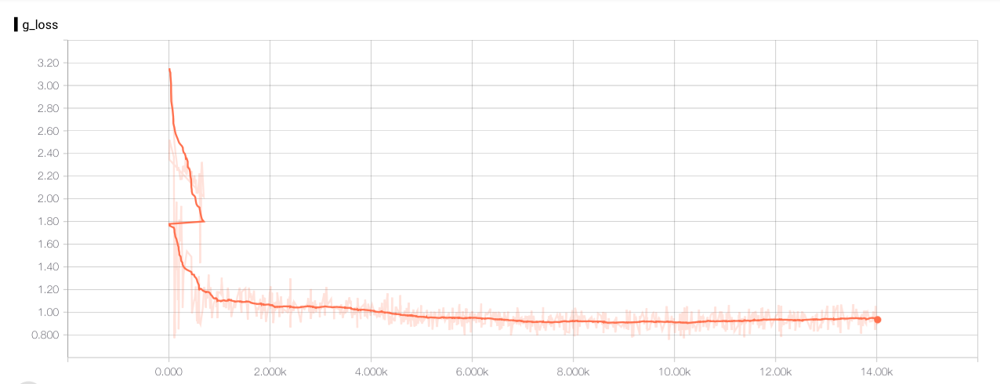

This repository contains the original source code of [MdidNet : A Convolutional Generative Adversarial Network for Symbolic-domain Music Generation](https://arxiv.org/abs/1703.10847).

Now you can find the pytorch implementation [in this repo](https://github.com/annahung31/MidiNet-by-pytorch).



## Follow-up research of MidiNet

If you are interesting to the follow-up research of MidiNet, please check out [MuseGAN: Symbolic-domain Music Generation and Accompaniment with Multi-track Sequential Generative Adversarial Networks](https://salu133445.github.io/musegan/).

Which we have a more detailed explanation of the data format (piano roll like feature with higher resolution compare to MidiNet).

## Notes

This is a slightly modified version of the model that we presented in the above paper, you can find notations in the code if the parameters differ from the paper.
We also provide a preliminary result of the model, which aims to help those who are interested of implementing MidiNet to gain more concept of the data format.


## Instructions

The repository contains a preliminary trained model, which is  trained under only 50496 midi bars(augmented from 4208 bars), so the generator might sounds not so "creative".

The model could be downloaded from the [link](https://drive.google.com/open?id=0B_B9afNKo7IqN205MzdLRFlOZzA).


It's quite fun to use Tencorboard to check out the model's training process: 
```
tensorboard --logdir=log/
```
You can check out the loss in the training, and the embedding visulizations of real and fake datas.



To train by your own dataset:
```
1. change line 134-136 to your data path
2. run main.py --is_train True
```

## Acknowledgment

These scripts are refer to [A tensorflow implementation of "Deep Convolutional Generative Adversarial Networks](https://github.com/carpedm20/DCGAN-tensorflow)

Thanks to Taehoon Kim / @carpedm20 for releasing such a decent DCGAN implementaion
## Requirements
[Tensorflow 0.12](https://github.com/tensorflow/tensorflow/tree/r0.12)

[python-midi](https://github.com/vishnubob/python-midi)
